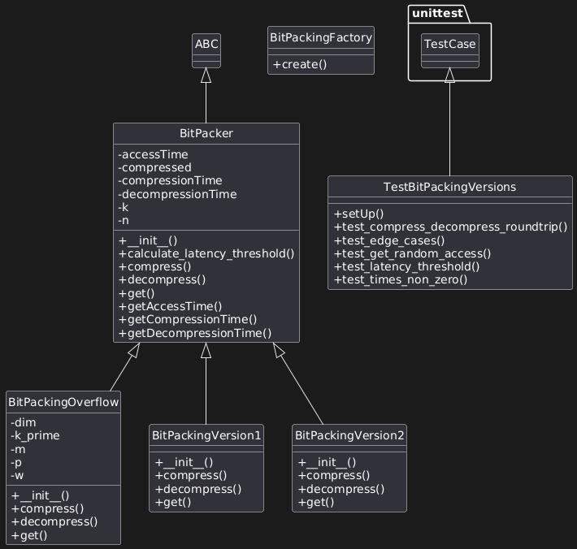

# Guide d'Exécution du Projet Bit Packing
Ce guide explique comment exécuter le projet de bit packing en Python. Le projet inclut trois variantes de compression (Version1, Version2, Overflow), une factory, des tests unitaires, un benchmarking, et un main interactif. Assurez-vous d'avoir Python 3.8+ installé.
## Prérequis

### Dépendances :

Standard : math, time, random, sys, statistics, json.
Optionnel pour optimisations : numpy (installez via pip install numpy).
Pour tests : unittest (intégré à Python).


### Fichiers du Projet :

BitPacking.py : Factory.
BitPackingVersion1.py : Version serrée.
BitPackingVersion2.py : Version alignée.
BitPackingOverflow.py : Version avec overflow.
main.py : Interface interactive.
testBitpacking.py : Tests unitaires.
benchmark.py : Script de benchmarking.

### Installation

Clonez ou téléchargez les fichiers.
Installez les dépendances (si besoin) :
```bash
pip install -r requirements.txt
```
## Exécution
Exécution du Main Interactif
Le main permet d'interagir avec les versions.py :
```bash
    python main.py
``` 
Suivez le menu :

1 : Compresser (besoin d'un tableau généré/chargé).
2 : Décompresser.
3 : Accès aléatoire (get).
4 : Voir temps.
5 : Calculer seuil de latence.
6 : Générer tableau aléatoire (taille, min, max).
7 : Changer version (via factory).
8 : Quitter.

Exemple : Générez un tableau (6), compressez (1), décompressez (2).
## Exécution des Tests Unitaires
```bash
    python -m test_versions.py
```
## Exécution du Benchmarking

```bash
    python benchmark.py
```

## Dépannage

Bugs Négatifs : Assurez two's complement intégré.
k > 32 : Erreur levée ; utilisez petits valeurs.
NumPy Manquant : Optionnel ; sautez optimisations.

Pour questions, consultez le rapport ou UML.
